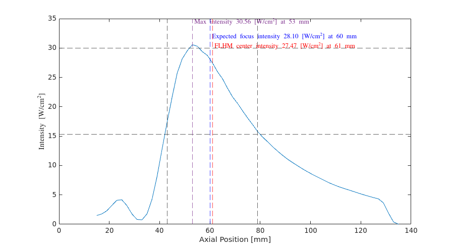
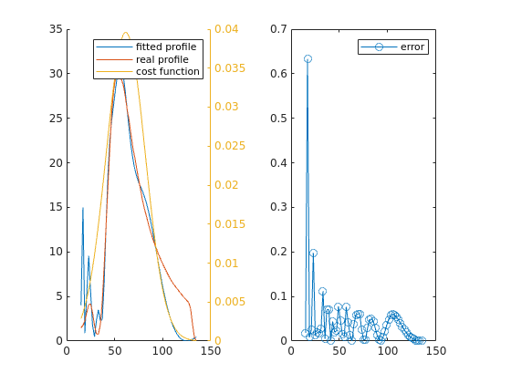
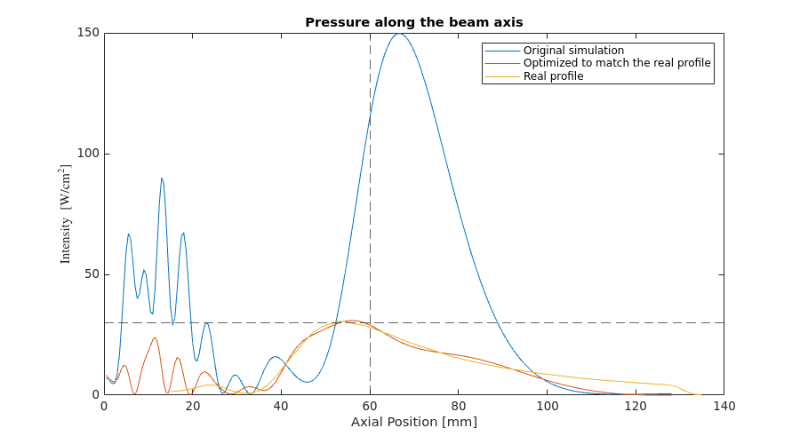
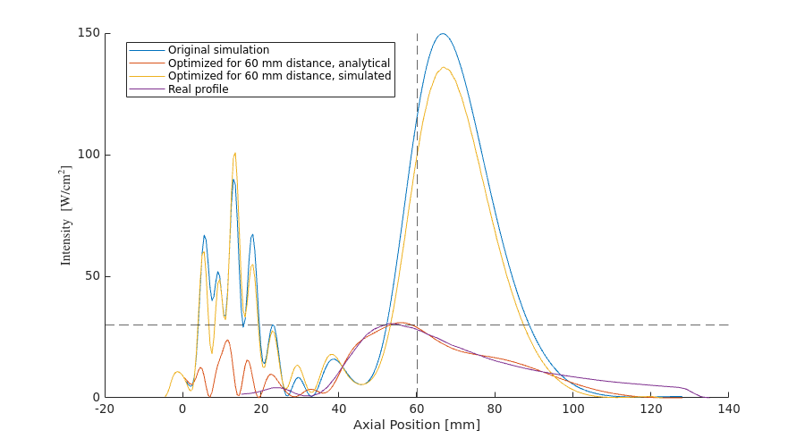
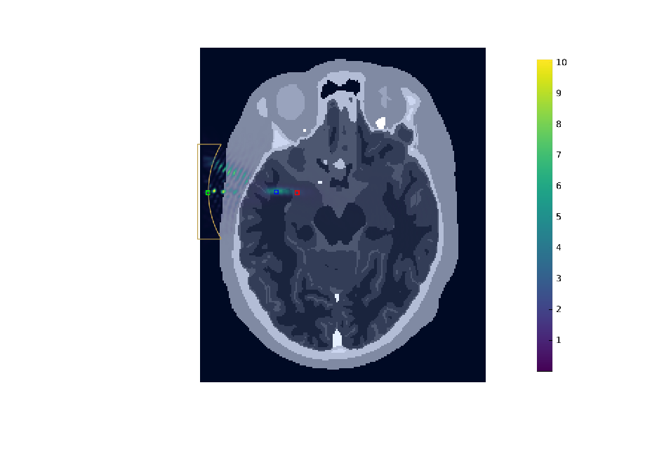
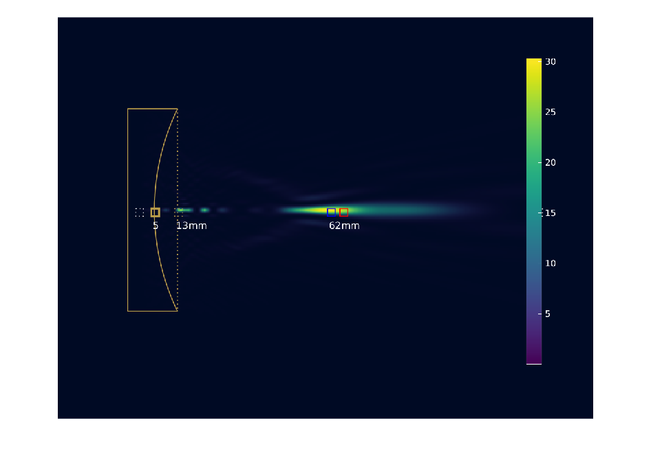

# Table of contents
- [Simulations in free water](#simulations-in-free-water)
- [Optimize for a given distance and pressure](#optimize-for-a-given-distance-and-pressure)
- [Simulate again in water to check the optimization results](#simulate-again-in-water-to-check-the-optimization-results)
- [Simulations using skull and brain](#simulations-using-skull-and-brain)

#  A short introduction to PRESTUS

PRESTUS is a package for acoustic and heating simulations built to simplify ultrasound neuromodulation studies, a wrapper for SimNIBS and k-Wave. This short demo shows how to use the package with the example subject data from SimNIBS.

The example dataset that is referred to are the T1 and T2 images of 'Ernie' (m2m_Ernie > T1.nii.gz \& T2_reg.nii.gz) which can be found on the SimNIBS website ([https://simnibs.github.io/simnibs/build/html/dataset.html](https://simnibs.github.io/simnibs/build/html/dataset.html)). This tutorial can access them by specifying it's location, leaving them zipped and renaming it to sub-001_T1 and T2 respectively.

Let's start with setting the environment. You'll need to change the path here to the directory you have PRESTUS in, and **also don't forget to change the paths in the config file (****`tutorial_config.yaml`****)**.

```matlab:Code
clear
cd /home/neuromod/marcorn/Documents/PRESTUS % change path to demo data here

submit_medium = 'slurm'; % run scripts via 'matlab' (debugging) or via a job using 'slurm' (recommended) or 'qsub'

% add paths
addpath('functions')
addpath(genpath('toolboxes')) 

if strcmp(submit_medium, 'qsub')
    addpath('/home/common/matlab/fieldtrip/qsub') % uncomment if you are using Donders HPC
end

use_cpu = false;
if strcmp(submit_medium, 'matlab')
    use_cpu = true;
end

if gpuDeviceCount==0 && ~exist('/home/common/matlab/fieldtrip/qsub','dir')
    warning('Many of the examples in this tutorial assume that you have a GPU available for computations or that you''re using the Donders HPC cluster. It looks like this is not the case. You can still run the tutorial but you''ll be automatically switched to using CPU which result in slow simulations.')
    use_cpu = true;
end
```

# Simulations in free water

Now, we start with the actual simulations. The first thing with the simulations is to ensure that you have the right settings. For the real US transducers, the settings are calibrated by the manufacturer. The company we buy the transducers from calibrates them to have a given maximum intensity and a given location of the acoustic peak (specifically, the center of its half-maximum range). 

Below, we read in two columns from the calibration sheet provided by the manufacturer. Specifically, we take the distance from the transducer axis and the intensity measured at each of these points. When using transducers with multiple elements, the depth of the acoustic peak (and thus the focus) can be steered by changing the set of phases for the individual transducer elements with respect to one-another. In this example, the intensity is taken from the column that set the phase angles to achieve a focus of 53mm in free water.

```matlab:Code
real_profile = readmatrix('examples/acoustic_profile_tutorial.csv');
desired_intensity = 30;

dist_to_exit_plane = round(63.2-52.38); % from the transducer specifications

figure('Position', [10 10 900 500]);
real_profile(:,1) = dist_to_exit_plane + real_profile(:,1);
plot(real_profile(:,1),real_profile(:,2))
```

```text:Output
Warning: MATLAB has disabled some advanced graphics rendering features by switching to software OpenGL. For more information, click here.
```

```matlab:Code

halfMax = (min(real_profile(:,2)) + max(real_profile(:,2))) / 2;
% Find where the data first drops below half the max.
index1 = find(real_profile(:,2) >= halfMax, 1, 'first');
% Find where the data last rises above half the max.
index2 = find(real_profile(:,2) >= halfMax, 1, 'last');

flhm = real_profile(index2,1) - real_profile(index1,1);
flhm_center_x = (real_profile(index2,1) - real_profile(index1,1))/2+real_profile(index1,1);
flhm_center_intensity = real_profile(real_profile(:,1)==flhm_center_x, 2);
xlabel('Axial Position [mm]');
ylabel('Intensity [W/cm^2]');
yline(desired_intensity, '--');
yline(halfMax, '--');
xline(real_profile(index1,1), '--');
xline(real_profile(index2,1), '--');
xline(flhm_center_x,'r--');
text(flhm_center_x+0.5, flhm_center_intensity+3, sprintf('FLHM center intensity %.2f [W/cm^2] at %i mm',flhm_center_intensity,flhm_center_x), "Color",'r');
expected_focus = 60;
intensity_at_expected_focus = mean(real_profile(real_profile(:,1)>=59&real_profile(:,1)<=61,2));
xline(expected_focus,'b--');
text(expected_focus+0.5, intensity_at_expected_focus+4, sprintf('Expected focus intensity %.2f [W/cm^2] at %i mm',intensity_at_expected_focus,expected_focus),"Color",'b');
[max_intensity, max_x] = max(real_profile(:,2));
xline(real_profile(max_x,1),'--','Color','#7E2F8E');
text(real_profile(max_x,1)+0.5, max_intensity+4, sprintf('Max intensity %.2f [W/cm^2] at %i mm',max_intensity,real_profile(max_x,1)),"Color",'#7E2F8E');
```




These settings are transformed into a set of phases for the individual transducer elements. Unfortunately, each transducer is unique, so the manufacturer's settings are not necessarily the ones you want to use in your simulations. The approach used here is to have an acoustic profile (i.e., the intensity along the beam axis of the transducer) so that the maximum point is at the expected distance and has the expected pressure. To have that, we start with the simulations in the water medium to find the phase-angles for the transducer elements needed for the simulation. 

The first step is to load the parameters. PRESTUS aims to separate the analysis and the configuration as much as possible, so most settings are kept in YAML format (https://en.wikipedia.org/wiki/YAML), a very simple markup language. The default settings are loaded from the `default_config.yaml` (all configs are kept in the `configs`  folder), on top of which you need to load your own study-specific settings. For this tutorial, the settings are kept in `tutorial_config.yaml`. You also need to set a subject number, and for this tutorial there is only one subject. And that's it! You can then start the simulations by running the `single_subject_pipeline()` function.` `

```matlab:Code
parameters = load_parameters('tutorial_config.yaml'); % load the configuration file

parameters.simulation_medium = 'water'; % indicate that we only want the simulation in the water medium for now
if use_cpu
    parameters.code_type = 'matlab_cpu';
end

subject_id = 1; % subject id doesn't matter here as we use the brain of Ernie from SimNIBS example dataset and the paths to T1/T2 files are hardcoded in the tutorial config; for the real analysis one usually uses templates based on subject ID, see example in the default config.
% Start the simulations - uncomment the next line if you haven't run them yet

if strcmp(submit_medium, 'qsub')
    % If you are using the Donders HPC cluster, you can do the simulations in
    % a non-interactive session with a qsub. To do so, set the interactive flag
    % to zero, set overwrite_files to 'always' (if you already have the results and want to recompute them), and run single_subject_pipeline_with_qsub.

    parameters.interactive = 0;
    parameters.overwrite_files = 'always';
    
    single_subject_pipeline_with_qsub(subject_id, parameters);
elseif strcmp(submit_medium, 'slurm')
    parameters.interactive = 0;
    parameters.overwrite_files = 'always';

    single_subject_pipeline_with_slurm(subject_id, parameters);
else
    parameters.using_donders_hpc = 0;
    single_subject_pipeline(subject_id, parameters);
end
```

```text:Output
Submitted the job to the cluster with a command 
cd /home/neuromod/marcorn/Documents/simnibs4_examples/m2m_ernie/sim_outputs/sub-001/batch_job_logs; sbatch /home/neuromod/marcorn/Documents/simnibs4_examples/m2m_ernie/sim_outputs/sub-001/batch_job_logs/tp29b25b1c_d955_4269_a33a_dfd1b0f9c0d8.sh 
See logs in /home/neuromod/marcorn/Documents/simnibs4_examples/m2m_ernie/sim_outputs/sub-001/batch_job_logs in case there are errors. 
Job name: PRESTUS_sub-001; job ID: 46914976
Job submitted successfully
Continuing with the MATLAB script...
```

```matlab:Code
   
```

After the simulations have finished, you can load the results. The results are saved under `sim_outputs` subdirectory of the data path that is defined in the config file along with some plots and summary statistics.

The data on pressure is saved in the `sensor_data `structure. First, we will plot a 2d pressure map by slicing the 3d pressure matrix at the focal plane. 

```matlab:Code
% load results
outputs_folder = sprintf('%s/sim_outputs/sub-%03d', parameters.data_path, subject_id);

load(sprintf('%s/sub-%03d_water_results%s.mat', outputs_folder, subject_id, parameters.results_filename_affix),'sensor_data','parameters');
```

```text:Output
Warning: Unable to load gpuArray data onto a GPU. Computations cannot be performed on this limited gpuArray. Use GATHER to retrieve the contents.
Warning: Unable to load gpuArray data onto a GPU. Computations cannot be performed on this limited gpuArray. Use GATHER to retrieve the contents.
```

```matlab:Code

% get maximum pressure
p_max = gather(sensor_data.p_max_all); % transform from GPU array to normal array

% plot 2d intensity map
imagesc((1:size(p_max,1))*parameters.grid_step_mm, ...
    (1:size(p_max,3))*parameters.grid_step_mm , ...
    squeeze(p_max(:,parameters.transducer.pos_grid(2),:))')
axis image;
colormap(getColorMap);
xlabel('Lateral Position [mm]');
ylabel('Axial Position [mm]');
axis image;
cb = colorbar;
title('Pressure for the focal plane')
```


Then, we can compare the simulated pressure along the focal axis and the pressure estimated with an analytic solution based on the equations provided by O'Neil (O'Neil, H. Theory of focusing radiators. J. Acoust. Soc. Am., 21(5), 516-526, 1949) and implemented in k-wave `focusedAnnulusONeil()` function.

```matlab:Code
% simulated pressure along the focal axis
pred_axial_pressure = squeeze(p_max(parameters.transducer.pos_grid(1),parameters.transducer.pos_grid(2),:)); % get the values at the focal axis

% compute O'Neil solution and plot it along with comparisons
% define transducer parameters

velocity = parameters.transducer.source_amp(1)/(parameters.medium.water.density*parameters.medium.water.sound_speed);   % [m/s]

% define position vectors
axial_position   = (1:parameters.default_grid_dims(3))*0.5;       % [mm]

% evaluate pressure analytically
% focusedAnnulusONeil provides an analytic solution for the pressure at the
% focal (beam) axis
[p_axial_oneil] = focusedAnnulusONeil(parameters.transducer.curv_radius_mm/1e3, ...
    [parameters.transducer.Elements_ID_mm; parameters.transducer.Elements_OD_mm]/1e3, repmat(velocity,1,parameters.transducer.n_elements), ...
    parameters.transducer.source_phase_rad, parameters.transducer.source_freq_hz, parameters.medium.water.sound_speed, ...
    parameters.medium.water.density, (axial_position-0.5)*1e-3);

% plot focal axis pressure
figure('Position', [10 10 900 500]);

plot(axial_position, p_axial_oneil .^2/(2*parameters.medium.water.sound_speed*parameters.medium.water.density) .* 1e-4);
xlabel('Axial Position [mm]');
ylabel('Intensity [W/cm^2]');
hold on
plot(axial_position-(parameters.transducer.pos_grid(3)-1)*0.5, pred_axial_pressure.^2/(2*parameters.medium.water.sound_speed*parameters.medium.water.density) .* 1e-4,'--');
plot(real_profile(:,1),real_profile(:,2))
hold off
xline(parameters.expected_focal_distance_mm, '--');
legend('Analytic solution','Simulated results','Real profile')
title('Pressure along the beam axis')
```


```matlab:Code
% what is distance to the maximum pressure?
fprintf('Estimated distance to the point of maximum pressure: %.2f mm\n',axial_position(p_axial_oneil==max(p_axial_oneil)))
```

```text:Output
Estimated distance to the point of maximum pressure: 66.50 mm
```

We want the simulated results to match the real profile as closely as possible, but as you can see that the two lines do not match exactly. There are two ways to deal with it, either you can use a newer kwaveArray class from k-wave (by setting `use_kWaveArray` flag in the config to 1) or you can introduce a correction factor as we do here. The kwaveArray solution is in theory better, but in practice it requires more time and memory. So for this tutorial, we will use a correction factor.

```matlab:Code
% compute the approximate adjustment from simulated (on a grid) to analytic solution
simulated_grid_adj_factor = max(pred_axial_pressure(:))/max(p_axial_oneil(:));
```

# Optimize for a given distance and pressure

So how to find the settings for the simulations that match the desired pressure and distance? It is easy to do, given that there is an analytic solution. For our subject, we assume that we know where the transducer is positioned and where we want to have the maximum pressure, so we know the distance at which the pressure should be maximal. We need to find the set of phases for transducer elements that would give the maximum pressure at the distance given in the manufacturers calibration sheet. We do so by searching through the parameter space (that is, varying the phases) as to minimize the error in distance to maximum pressure point. 

```matlab:Code
gs = GlobalSearch;
%opt_velocity = desired_pressure/max_pressure*velocity;

%optimize_phases = @(phases) phase_optimization_annulus(phases, parameters, velocity, axial_position, parameters.expected_focal_distance_mm);
optimize_phases = @(phases_and_velocity) phase_optimization_annulus_full_curve(phases_and_velocity(1:(parameters.transducer.n_elements - 1)), parameters, phases_and_velocity(parameters.transducer.n_elements),...
    real_profile(:,1), real_profile(:,2));

rng(195,'twister') % setting seed for consistency
problem = createOptimProblem('fmincon','x0', [randi(360, [1 parameters.transducer.n_elements - 1])/180*pi velocity],...
    'objective',optimize_phases,'lb',zeros(1,parameters.transducer.n_elements),'ub',[2*pi*ones(1,parameters.transducer.n_elements - 1) 0.2], 'options', optimoptions('fmincon','OptimalityTolerance', 1e-8)); 

[opt_phases_and_velocity, min_err] = run(gs,problem);
```

```text:Output
GlobalSearch stopped because it analyzed all the trial points.

The local solver ran once and it converged with a positive local solver exitflag.
```

```matlab:Code
% plot optimization results
phase_optimization_annulus_full_curve(opt_phases_and_velocity(1:(parameters.transducer.n_elements - 1)), parameters, opt_phases_and_velocity(parameters.transducer.n_elements),...
    real_profile(:,1), real_profile(:,2), 1);
```

```text:Output
Warning: Ignoring extra legend entries.
```




```matlab:Code

fprintf('Optimal phases: %s deg.; velocity: %.2f; optimization error: %.2f', mat2str(round(opt_phases_and_velocity(1:(parameters.transducer.n_elements - 1))/pi*180)), opt_phases_and_velocity(parameters.transducer.n_elements), min_err)
```

```text:Output
Optimal phases: [293 259 251 312 0 360 0 227 151] deg.; velocity: 0.08; optimization error: 0.04
```

The left plot above shows the real and the fitted profiles along with the cost function used for fitting, while the right shows the error in fitting (the squared difference between the real and the fitted profile weighted by the cost function). 

The phase-angles given above should be copied into the config under the parameter "source_phase_deg". Keep in mind that different settings should be calculated and used for every transducer and every focus distance.

We also need to know the pressure for the simulated transducer so that in the water, the intensity (ISPPA) would be 30 W/cm^2. To do so, we first compute the analytic solution with the new phases but the original pressure, and then use it to adjust the simulated pressure and recompute the analytic solution (the latter is just for plotting). 

```matlab:Code
opt_phases = opt_phases_and_velocity(1:(parameters.transducer.n_elements - 1));
opt_velocity = opt_phases_and_velocity(parameters.transducer.n_elements);

[p_axial_oneil_opt] = focusedAnnulusONeil(parameters.transducer.curv_radius_mm/1e3, ...
    [parameters.transducer.Elements_ID_mm; parameters.transducer.Elements_OD_mm]/1e3, repmat(opt_velocity,1,parameters.transducer.n_elements), ...
    [0 opt_phases], parameters.transducer.source_freq_hz, parameters.medium.water.sound_speed, ...
    parameters.medium.water.density, (axial_position-0.5)*1e-3);

figure('Position', [10 10 900 500]);
plot(axial_position, p_axial_oneil.^2/(2*parameters.medium.water.sound_speed*parameters.medium.water.density) .* 1e-4);
xlabel('Axial Position [mm]');
ylabel('Intensity [W/cm^2]');
hold on
plot(axial_position, p_axial_oneil_opt .^2/(2*parameters.medium.water.sound_speed*parameters.medium.water.density) .* 1e-4);
plot(real_profile(:,1),real_profile(:,2))
hold off
xline(parameters.expected_focal_distance_mm, '--');
yline(30, '--');
legend('Original simulation', sprintf('Optimized to match the real profile'),'Real profile')
title('Pressure along the beam axis')
```




```matlab:Code

fprintf('Estimated distance to the point of maximum pressure: %.2f mm\n',axial_position(p_axial_oneil_opt==max(p_axial_oneil_opt)))
```

```text:Output
Estimated distance to the point of maximum pressure: 56.00 mm
```

```matlab:Code
fprintf('Estimated distance to the center of half-maximum range: %.2f mm\n', get_flhm_center_position(axial_position, p_axial_oneil_opt))
```

```text:Output
Estimated distance to the center of half-maximum range: 68.25 mm
```

# Simulate again in water to check the optimization results

Now we will redo the simulations with new parameters. We copy the configuration, update the settings with the optimized parameters, and rerun the simulations. 

```matlab:Code
opt_source_amp = round(opt_velocity/velocity*parameters.transducer.source_amp/simulated_grid_adj_factor);

opt_parameters = load_parameters('tutorial_config.yaml'); 
opt_parameters.transducer.source_amp = opt_source_amp;
opt_parameters.transducer.source_phase_rad = [0 opt_phases];
opt_parameters.transducer.source_phase_deg = [0 opt_phases]/pi*180;
opt_parameters.results_filename_affix = '_optimized';
opt_parameters.simulation_medium = 'water';

if use_cpu
    opt_parameters.code_type = 'matlab_cpu'
end

if strcmp(submit_medium, 'qsub')
    % If you are using the Donders HPC cluster, you can do the simulations in
    % a non-interactive session with a qsub. To do so, set the interactive flag
    % to zero, set overwrite_files to 'always' (if you already have the results and want to recompute them), and run single_subject_pipeline_with_qsub.

    opt_parameters.interactive = 0;
    opt_parameters.overwrite_files = 'always';
    
    single_subject_pipeline_with_qsub(subject_id, opt_parameters);
elseif strcmp(submit_medium, 'slurm')
    opt_parameters.interactive = 0;
    opt_parameters.overwrite_files = 'always';
    single_subject_pipeline_with_slurm(subject_id, opt_parameters);
else
    opt_parameters.using_donders_hpc = 0;
    single_subject_pipeline(subject_id, opt_parameters)
end
```

```text:Output
Submitted the job to the cluster with a command 
cd /home/neuromod/marcorn/Documents/simnibs4_examples/m2m_ernie/sim_outputs/sub-001/batch_job_logs; sbatch /home/neuromod/marcorn/Documents/simnibs4_examples/m2m_ernie/sim_outputs/sub-001/batch_job_logs/tpad6599f1_223c_486a_ba8e_813abe67d692.sh 
See logs in /home/neuromod/marcorn/Documents/simnibs4_examples/m2m_ernie/sim_outputs/sub-001/batch_job_logs in case there are errors. 
Job name: PRESTUS_sub-001; job ID: 46914978
Job submitted successfully
Continuing with the MATLAB script...
```

After the simulations are complete, we plot them alongside the analytic solution. 

```matlab:Code
opt_res = load(sprintf('%s/sub-%03d_water_results%s.mat', outputs_folder, subject_id, opt_parameters.results_filename_affix),'sensor_data','parameters');
```

```text:Output
Warning: Unable to load gpuArray data onto a GPU. Computations cannot be performed on this limited gpuArray. Use GATHER to retrieve the contents.
Warning: Unable to load gpuArray data onto a GPU. Computations cannot be performed on this limited gpuArray. Use GATHER to retrieve the contents.
```

```matlab:Code

% get maximum pressure
p_max = gather(opt_res.sensor_data.p_max_all);
pred_axial_pressure_opt = squeeze(p_max(opt_res.parameters.transducer.pos_grid(1), opt_res.parameters.transducer.pos_grid(2),:));

figure('Position', [10 10 900 500]);
hold on
plot(axial_position, p_axial_oneil.^2/(2*parameters.medium.water.sound_speed*parameters.medium.water.density) .* 1e-4);
xlabel('Axial Position [mm]');
ylabel('Intensity [W/cm^2]');
plot(axial_position, p_axial_oneil_opt .^2/(2*parameters.medium.water.sound_speed*parameters.medium.water.density) .* 1e-4);

sim_res_axial_position = axial_position-(opt_res.parameters.transducer.pos_grid(3)-1)*0.5; % axial position for the simulated results, relative to transducer position
plot(sim_res_axial_position, ...
    pred_axial_pressure_opt .^2/(2*parameters.medium.water.sound_speed*parameters.medium.water.density) .* 1e-4);
plot(real_profile(:,1),real_profile(:,2))
hold off
xline(opt_res.parameters.expected_focal_distance_mm, '--');
yline(desired_intensity, '--');
legend('Original simulation', sprintf('Optimized for %2.f mm distance, analytical', opt_res.parameters.expected_focal_distance_mm), ...
    sprintf('Optimized for %2.f mm distance, simulated', opt_res.parameters.expected_focal_distance_mm),'Real profile','Location', 'best')
```




```matlab:Code
fprintf('Estimated distance to the point of maximum pressure: %.2f mm\n',sim_res_axial_position(pred_axial_pressure_opt==max(pred_axial_pressure_opt)))
```

```text:Output
Estimated distance to the point of maximum pressure: 67.00 mm
```

As you can see, now the simulated acoustic profile has the desired distance to maximum and intensity, which means we can start with the simulations for the actual brain.

# Simulations using skull and brain

The first part repeats what we have done before: the parameters are loaded and the settings are updated. 

```matlab:Code
opt_parameters = load_parameters('tutorial_config.yaml'); 

opt_parameters.transducer.source_amp = opt_source_amp;
opt_parameters.transducer.source_phase_rad = [0 opt_phases];
opt_parameters.transducer.source_phase_deg = [0 opt_phases]/pi*180;
opt_parameters.results_filename_affix = '_optimized';
```

Now, at the next step we set the simulation medium to `"layered"` to indicate that we would use the actual brain image and we want to have different layers, such as skin, skull, and brain. These layers will be extracted from the T1 and T2 scans by SimNIBS during the initial processing, and then they will be used to create a heterogeneous simulations medium. 

```matlab:Code
opt_parameters.simulation_medium = 'layered'; % see default config for the list of mediums possible

opt_parameters.run_heating_sims = 1; % this indicates that we want the heating simulations as well

if use_cpu
    opt_parameters.code_type = 'matlab_cpu'
end

% Again, if you want to rerun the simulations, you can do it in an
% interactive mode (useful when running on your laptop) or
% non-interactively (useful at the cluster) with

if strcmp(submit_medium, 'qsub')
    opt_parameters.interactive = 0;
    opt_parameters.overwrite_files = 'always';
    
    single_subject_pipeline_with_qsub(subject_id, opt_parameters);
elseif strcmp(submit_medium, 'slurm')
    opt_parameters.interactive = 0;
    opt_parameters.overwrite_files = 'always';
    single_subject_pipeline_with_slurm(subject_id, opt_parameters);
else
    % or with
    opt_parameters.using_donders_hpc = 0;
    single_subject_pipeline(subject_id, opt_parameters); 
end
```

```text:Output
Submitted the job to the cluster with a command 
cd /home/neuromod/marcorn/Documents/simnibs4_examples/m2m_ernie/sim_outputs/sub-001/batch_job_logs; sbatch /home/neuromod/marcorn/Documents/simnibs4_examples/m2m_ernie/sim_outputs/sub-001/batch_job_logs/tp78ca0690_6e35_47f1_a777_9a01e40991b3.sh 
See logs in /home/neuromod/marcorn/Documents/simnibs4_examples/m2m_ernie/sim_outputs/sub-001/batch_job_logs in case there are errors. 
Job name: PRESTUS_sub-001; job ID: 46915015
Job submitted successfully
Continuing with the MATLAB script...
```

The simulations will take a long time. As a result, there will be some plots and matlab outputs in the `sim_outputs` folder. Let's look at some of them.

This is the original T1 file superimposed with the predicted intensity. The transducer is shown in green and the intended stimulation location in red. Note that this is the slice in the plane along the focal axis. We are slightly undershooting the target here. 

```matlab:Code
imshow(imread(sprintf('%s/sub-%03d/sub-%03d_layered_isppa%s.png', opt_parameters.temp_output_dir , subject_id, subject_id,  '_optimized')))
```



A slight undershoot is also visible in free water. In this image, the yellow outline shows the transducer, the red point is the expected focus position and the blue one is the maximum focus position in the simulation. 

```matlab:Code
imshow(imread(sprintf('%s/sub-%03d/sub-%03d_water_isppa%s.png', opt_parameters.temp_output_dir , subject_id, subject_id, '_optimized')))
```




You can also look at the heating simulations results:

```matlab:Code
imshow(imread(sprintf('%s/sub-%03d/sub-%03d_layered_heating_by_time%s.png',opt_parameters.temp_output_dir , subject_id, subject_id, '_optimized')))
```


Here the lines show different voxels along the focal axis. Importantly, we see that with the current design, the temperature rises continuously for some voxels (check the video file in the `sim_outputs` folder as well), suggesting that one might need to introduce longer breaks to avoid excessive heating. 
